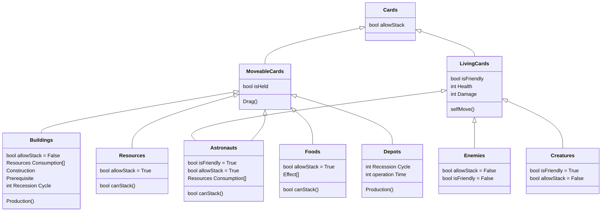

# Card Class Design

```mermaid
classDiagram
    Cards <|-- Moveable Cards
    Cards <|-- Living Cards
    Moveable Cards <|-- Astronauts
    Living Cards  <|-- Astronauts
    Living Cards  <|-- Enemies
    Living Cards  <|-- Creatures
    Moveable Cards <|-- Buildings
    Moveable Cards <|-- Resources
    Moveable Cards <|-- Foods
    Moveable Cards <|-- Depots
    class Cards{
    		bool allowStack
    }
    class Moveable Cards{
    		bool isHeld
        Drag()
    }
    class Living Cards{
        selfMove()
        bool isFriendly
        int Health
        int Damage
    }
    class Enemies{
    	bool allowStack = False
    	bool isFriendly = False

    }
    class Astronauts{
    	bool isFriendly = True
    	bool allowStack = True
    	Resources Consumption[]
    	bool canStack()
    }
    class Buildings{
    	bool allowStack = False
    	Resources Consumption[]
    	Production()
    	Construction
    	Prerequisite
    	int Recession Cycle
    }
    class Resources{
    	bool allowStack = True
    	bool canStack()
    }
    class Foods {
    	bool allowStack = True
    	Effect[]
    	bool canStack()
    }
    class Depots {
    	int Recession Cycle
    	Production()
    	int operation Time
    }
    class Creatures{
    bool isFriendly = True
    	bool allowStack = False
		}
    

```

